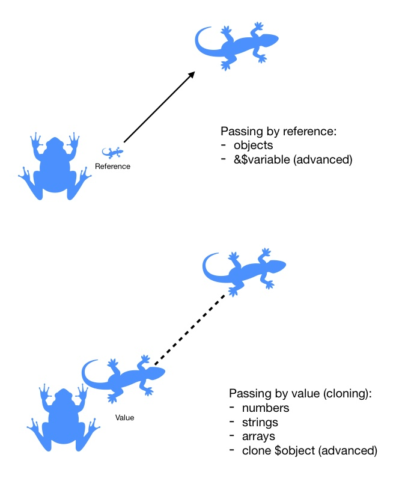

```*** Setting up Lesson4 ***

1. Clone or extract this repository and navigate to lesson4:
$ cd kit_course_php/lesson4

2. Start Docker container:
$ docker-compose up -d

3. Connect to Docker container:
$ docker-compose exec php /bin/bash;

4. Ensure you are at the application root:
$ cd /app

5. Build project:
$ composer install

6. Run phonebook.php:

- To add a phonebook record use:  
$ php phonebook.php save NAME PHONENUMBER 

- To find a phonebook record use:
$ php phonebook.php read NAME


*** Some useful notes ***

PHP is a stateless language.
The application lifecycle starts from the first input and ends after the last output is made.

How are arguments being passed - by reference or by value?

```

